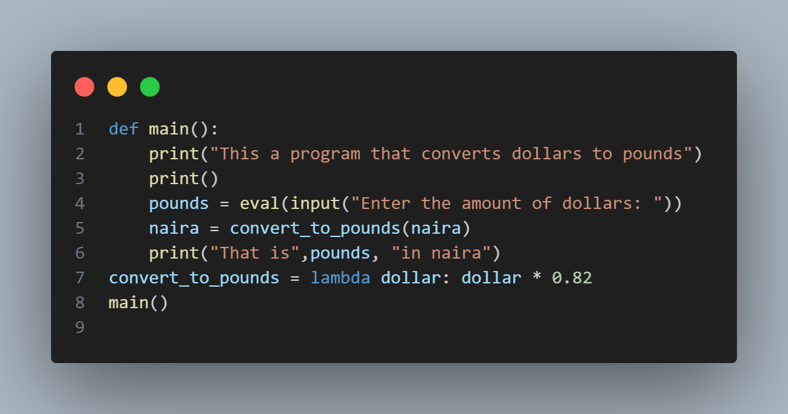

# currency-converter

There isn't much code in creating a currency converter in python(it converts dollars to pounds), you just have to follow a few steps:

1. Create a def() function with the function(main()), then print a welcoming message like(print("Welcome to the currency converter")).Create var(dollars), then put in an eval and input function(dollars = eval(input("Enter the amount of dollars: "))). Create another var(pounds), then put in another var(convert_to_pounds) inside the var(pounds) 
2. Then print something like(print("That is",pounds ," in pounds")). You might be getting an error but we will fix that now. Out side the def()function, create the var(convert_to_pounds), then put in a lambda function there(lambda dollars:), put in the var()dollars * 0.82 .Print out the def function(main())

Thats all for the currency-converter, there wasn't much code. I knew the currency i was meant to multiply the var(dollars) with because i searched it on google.
If you don't understand everything i typed out, look at the image; 
